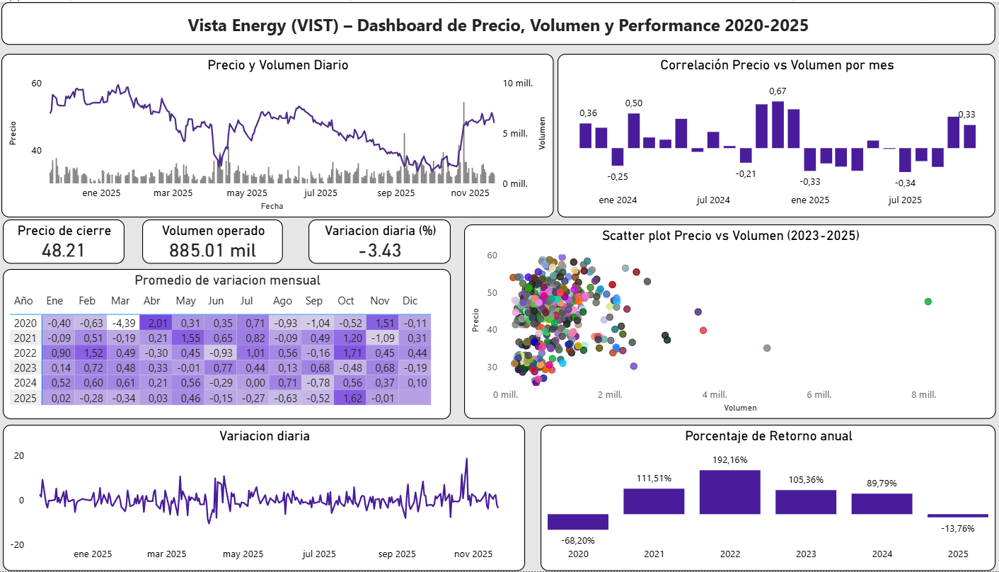

# Análisis de Precio, Volumen y Retornos - Vista Energy (VIST)  
2020 - 2025

##  Flujo de trabajo

- Extracción →  Limpieza →  Análisis →  Visualización →  Informe

##  Objetivo
Analizar el comportamiento histórico del precio de la acción de Vista Energy (VIST) desde enero de 2020 hasta noviembre de 2025, evaluando la evolución del precio, la volatilidad diaria y mensual, la relación precio-volumen y los retornos anuales, con especial foco en el desempeño durante 2025 y en la identificación de patrones relevantes para la toma de decisiones de inversión.

##  Fuente de los datos
- Investing.com  
  https://es.investing.com/equities/vista-oil-gas-adr-historical-data  
- Período: 02/01/2020 - 20/11/2025  
- Variables: Fecha, Precio de cierre (Último), Volumen, Var% diaria

##  Herramientas utilizadas
- Python (Pandas, NumPy): limpieza, transformación y cálculo de métricas
- Matplotlib, Seaborn: visualizaciones
- Power BI: dashboards
- 

## Gráficos destacados

## Informe completo
Podés ver el informe completo del proyecto en formato PDF:  
[Informe Análisis Vista Energy](./reports/Informe_de_Vista_Energy.pdf)

**Autor:**  
**Matías Costa**  
Data Analyst | Estudiante de Licenciatura en Informática